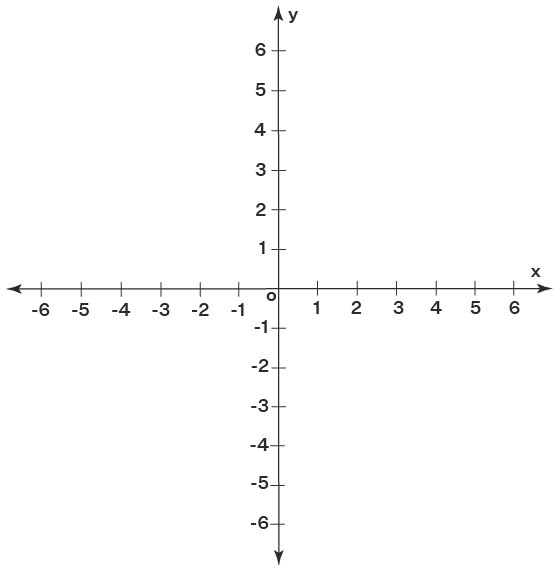
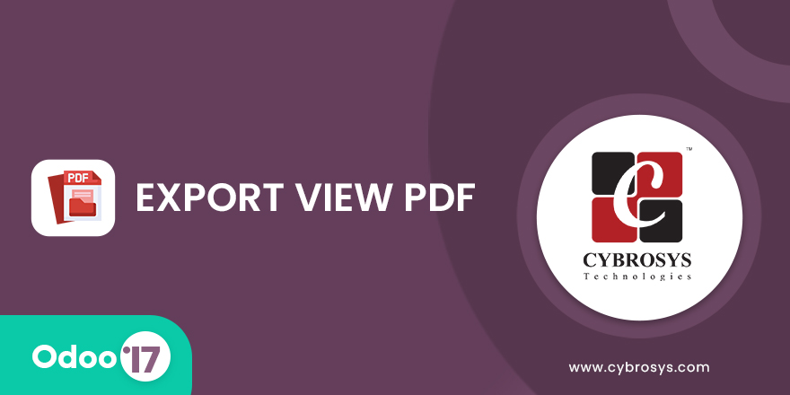

 

**Full-cycle Odoo ERP** · Python · PostgreSQL · JavaScript/OWL · REST APIs · Automation

---

## 👋 About

Senior **Odoo Developer** and **Technical Team Leader** at **CTIT Software** (Jeddah). I build production ERP systems—custom modules, Saudi compliance (ZATCA, GOSI), eCommerce connectors (Salla, Zid), payment gateways (Geidea), and reusable frameworks used across **70+ implementations**.

---

## 🏢 Enterprise Projects `15`

<table>
<thead>
<tr>
<th align="left">#</th>
<th align="left">Project</th>
<th>Industry</th>
<th>Odoo</th>
<th>Role</th>
<th align="left">Deliverables</th>
</tr>
</thead>
<tbody>
<tr><td>01</td><td><b>CTIT Official Platform</b></td><td>ERP / SaaS</td><td>17</td><td>Team Leader</td><td>Core stack, Saudi EDI, subscriptions, shared frameworks, 70+ clients</td></tr>
<tr><td>02</td><td><b>CTIT SaaS Hosting</b></td><td>Cloud ERP</td><td>17</td><td>Lead</td><td>Portainer/Docker provisioning, Traefik, backups, SaaS billing portal</td></tr>
<tr><td>03</td><td><b>Al Shatry</b></td><td>Trading / Wholesale</td><td>13 / 17</td><td>Senior</td><td>Full ERP, branches, landed costs, ZATCA e-invoicing</td></tr>
<tr><td>04</td><td><b>Al Bilady</b></td><td>Retail / Distribution</td><td>16 / 17</td><td>Lead</td><td>Multi-branch sales, stock, accounting automation, reporting</td></tr>
<tr><td>05</td><td><b>Mega Trust</b></td><td>Distribution</td><td>17 / 18</td><td>Senior</td><td>Purchase tiers, warehouse OWL widget, cheques, Salla sync</td></tr>
<tr><td>06</td><td><b>Roya</b></td><td>Multi-branch ERP</td><td>15</td><td>Senior</td><td>Branch sequences, GCC tax reports, custom QWeb, GOSI HR</td></tr>
<tr><td>07</td><td><b>Al Suwailim (Vegetables)</b></td><td>Fresh produce / Hraj</td><td>17</td><td>Senior</td><td>Sale automation, ZATCA, partner APIs, portal, stock-to-invoice</td></tr>
<tr><td>08</td><td><b>GOSI Compliance</b></td><td>HR / Insurance</td><td>17</td><td>Architect</td><td>Contribution rules, wages, audit logs, future API connector</td></tr>
<tr><td>09</td><td><b>Bonya Real Estate</b></td><td>Property</td><td>17</td><td>Lead</td><td>40+ modules: contracts, rental, Hijri UI, WhatsApp, LC, reports</td></tr>
<tr><td>10</td><td><b>IQAA Steel Factory</b></td><td>Manufacturing / POS</td><td>17</td><td>Lead</td><td>Arabic POS delivery workflow, OWL screens, status tracking</td></tr>
<tr><td>11</td><td><b>Dabbos</b></td><td>Trading / Reports</td><td>17 / 18</td><td>Lead</td><td>Custom invoice/sale/stock reports, salesperson analytics</td></tr>
<tr><td>12</td><td><b>Aloofy</b></td><td>Retail / F&B</td><td>16</td><td>Senior</td><td>160+ modules: POS, WhatsApp sales, veg partners, automation</td></tr>
<tr><td>13</td><td><b>AlMoasher Business</b></td><td>Enterprise</td><td>14–17</td><td>Senior</td><td>Core module customization, security, multi-company workflows</td></tr>
<tr><td>14</td><td><b>Capital ERP</b></td><td>ERP (Iraq)</td><td>17</td><td>Senior</td><td>Finance/HR modules, API integrations, production support</td></tr>
<tr><td>15</td><td><b>Healthy (AE / EG / KSA)</b></td><td>Healthcare</td><td>15</td><td>Developer</td><td>Multi-country Odoo rollout, regional customizations</td></tr>
</tbody>
</table>

---

## 🧩 Product Modules & Integrations `20`

> Unified stack: **Python ORM** backend · **XML/QWeb** reports · **OWL/JavaScript** UI · **automation** & **server actions**

<table>
<thead>
<tr>
<th>Module</th>
<th>Name</th>
<th>Category</th>
</tr>
</thead>
<tbody>
<tr><td><code>dynamic_template_design</code></td><td>Dynamic Report Designer</td><td>Reporting</td></tr>
<tr><td><code>ctit_rules_studio</code></td><td>Access & Permissions Studio</td><td>Security / OWL</td></tr>
<tr><td><code>api_gateway_rest</code></td><td>REST Application Gateway</td><td>Integration</td></tr>
<tr><td><code>api_gateway_webhook_ext</code></td><td>Webhook Extensions</td><td>Integration</td></tr>
<tr><td><code>connect_einv_api</code></td><td>ZATCA E-Invoicing</td><td>Compliance</td></tr>
<tr><td><code>odoo_salla_integration</code></td><td>Salla Connector (CTIT)</td><td>eCommerce</td></tr>
<tr><td><code>mega_salla_integration</code></td><td>Salla Connector (Mega)</td><td>eCommerce</td></tr>
<tr><td><code>zid_integration</code></td><td>Zid Marketplace</td><td>eCommerce</td></tr>
<tr><td><code>sale_order_automation</code></td><td>Sales Order Workflow</td><td>Automation</td></tr>
<tr><td><code>geidea_payment</code></td><td>Geidea Payment Gateway</td><td>Payments</td></tr>
<tr><td><code>gosi_compliance_layer</code></td><td>GOSI Compliance Core</td><td>HR / KSA</td></tr>
<tr><td><code>gosi_api_connector</code></td><td>GOSI API Connector</td><td>HR / API</td></tr>
<tr><td><code>general_ctit17</code></td><td>CTIT Core Platform</td><td>Platform</td></tr>
<tr><td><code>dynamic_list_view</code></td><td>Dynamic List Columns</td><td>UI Tools</td></tr>
<tr><td><code>dev_ops_dashboard</code></td><td>Developer Ops Dashboard</td><td>Project KPIs</td></tr>
<tr><td><code>real_estate_adjustment</code></td><td>Real Estate Suite</td><td>Property</td></tr>
<tr><td><code>rental_contract_management</code></td><td>Rental Contracts</td><td>Property</td></tr>
<tr><td><code>hijri_datepicker</code></td><td>Hijri Datepicker (JS)</td><td>Localization</td></tr>
<tr><td><code>od_branch_sequence</code></td><td>Branch Document Sequences</td><td>Accounting</td></tr>
<tr><td><code>odoo_saas_portainer</code></td><td>SaaS Stack Provisioner</td><td>DevOps</td></tr>
</tbody>
</table>

---

## 🎬 Featured Demos & Screenshots

### CTIT Rules Studio — In-context access control (OWL / JavaScript)

<table>
<tr>
<td width="48%">

**Features**
- Hide menus, fields, buttons, tabs, views per user/group
- **Rules Mode**: edit access live on the form (no separate admin UI)
- Read-only users, export/archive restrictions
- Pivot/graph/chatter controls · multi-company

</td>
<td width="52%" align="center">

<video controls width="100%" src="https://github.com/odoo00/odoo00/raw/main/assets/rules-studio-demo.mp4"></video>

▶ <a href="https://github.com/odoo00/odoo00/raw/main/assets/rules-studio-demo.mp4">Watch Rules Studio demo</a> · Odoo 17

</td>
</tr>
</table>

---

### Dynamic Report Designer — No-code QWeb / DOCX

<table>
<tr>
<td>

**Features**
- Visual report builder without Python
- 10+ corporate QWeb style templates
- DOCX merge, dot-matrix & summary layouts
- Custom headers/footers per company

</td>
<td align="center">

</td>
</tr>
</table>

---

### Geidea Payment Gateway

<table>
<tr>
<td>

**Features**
- Payment links on sales orders, invoices & payments
- Server-to-server status callbacks
- Apple Pay / Mada assets · email payment templates
- Error mapping & transaction state sync

</td>
<td align="center">

</td>
</tr>
</table>

---

### ZATCA · Salla · Sales Automation · GOSI · SaaS

| Module | Key features |
|--------|----------------|
| **ZATCA** (`connect_einv_api`) | E-invoice submit, QR string, retry, state tracking on `account.move` |
| **Salla** | Webhooks: products, orders, stock, payments; channel logs & reconciliation |
| **Sale automation** | On SO confirm → create/validate invoice → transfer delivery (configurable) |
| **GOSI** | Eligibility rules, contribution wages, audit trail, API connection profiles |
| **SaaS Portainer** | Docker stack deploy, cron health, backup history, subscription packages |
| **Real estate** | Rental contracts, opening balances, client status (Hijri), project costing |
| **Dynamic list view** | Show/hide/reorder/relabel list columns from UI |
| **DevOps dashboard** | Team KPIs, assignment wizard, project/task intelligence boards |

Export / PDF tooling used across CTIT & Bonya implementations

---

## 🛠 Tech Stack

**Odoo** 14 · 15 · 16 · 17 · **OWL** · **QWeb** · **REST/SOAP** · **XML-RPC** · **Docker** · **Portainer** · **Traefik**

---

## 📊 GitHub Stats

---

## 📫 Contact

| | |
|---|---|
| 📧 | [dev.odooerp@gmail.com](mailto:dev.odooerp@gmail.com) |
| 💼 | [LinkedIn — Mohsen Sayed Hassan](https://www.linkedin.com/in/mohsen-sayed-hassan) |
| 📱 | +20 127 752 3059 |

---

**For recruiters:** Production Odoo modules & client repos are private · This profile summarizes real delivered work.

⭐ If you find this useful, a star helps visibility.

