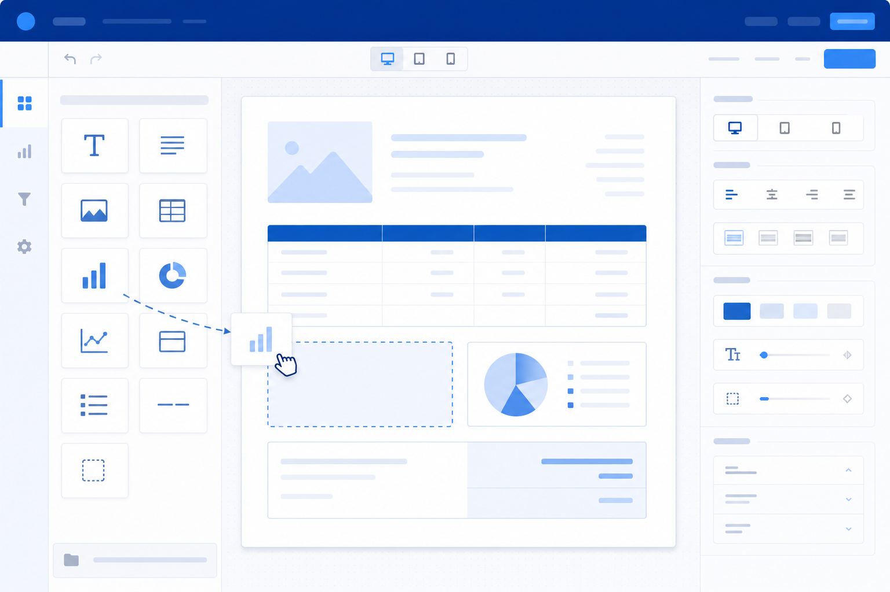
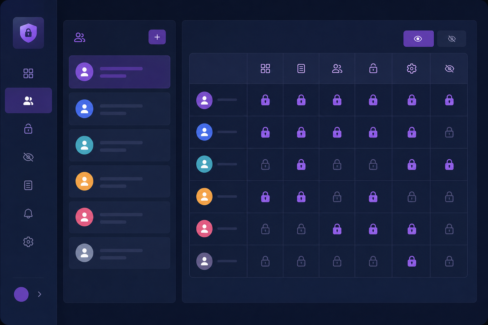
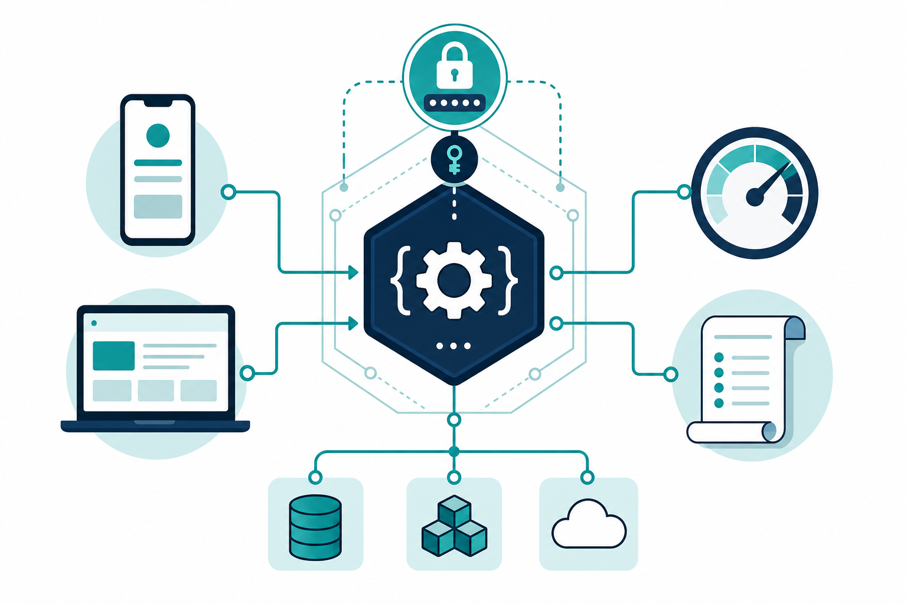
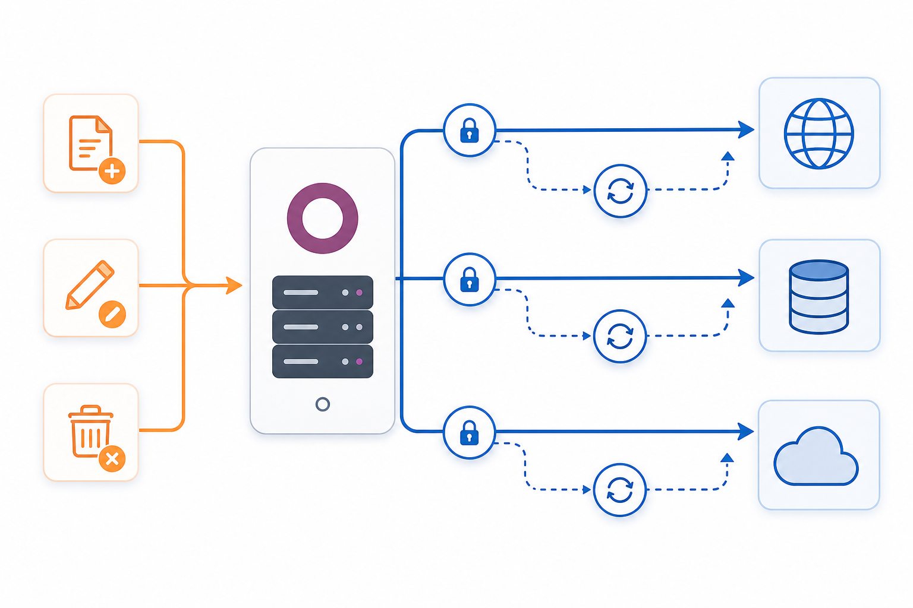
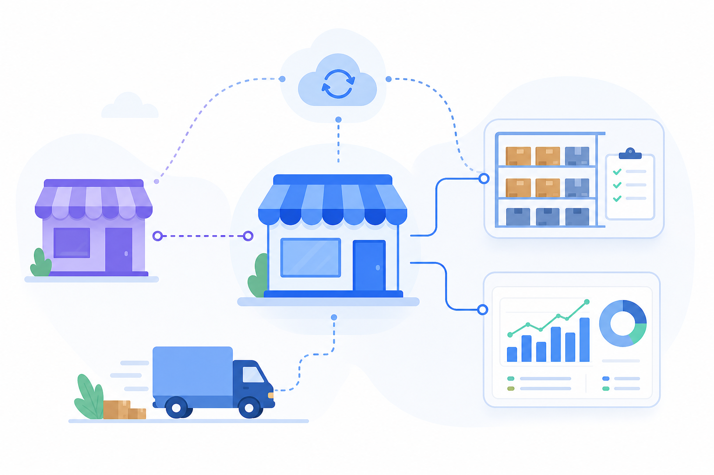

<!-- PORTFOLIO DISPLAY PROFILE — Maintained by Mohsen Sayed Hassan only -->

# Mohsen Sayed Hassan

### Senior Odoo Developer · Technical Team Leader

📱 **+20 127 752 3059**  
📧 [dev.odooerp@gmail.com](mailto:dev.odooerp@gmail.com)  
💼 [LinkedIn](https://www.linkedin.com/in/mohsen-sayed-hassan-12856a2a7/) · 🐙 [GitHub](https://github.com/odoo00)

**Odoo 9 → 19** · 9+ years · Egypt · Saudi Arabia · Iraq · **70+ ERP implementations**

 

> 🔒 **Portfolio display only** — This page is a recruiter-friendly overview of production work.  
> Client code lives in private repositories. **Editing access: repository owner only** (GitHub account `odoo00`).

---

## 👋 About

I lead and build **full-cycle Odoo ERP**: requirements, architecture, custom development, integrations, deployment, and support. Focus on **Saudi compliance** (ZATCA, GOSI), **marketplaces** (Salla, Zid), **payment gateways** (Geidea), and **reusable product frameworks** for CTIT and enterprise clients.

---

## ⭐ Flagship Solutions — Detailed Overview

Click each section to expand. All descriptions reflect **real implemented features** from production modules.

---

<b>📄 Dynamic Report Designer</b> &nbsp;·&nbsp; Reporting &nbsp;·&nbsp; No-code QWeb & DOCX

 

<table>
<tr>
<td width="55%" valign="top">

#### Overview
Design and publish Odoo reports **without writing Python** — bind any model, pick a visual theme, and replace standard prints with branded layouts.

#### Report types supported
- Custom, Proforma, Invoice, Vendor Bill, Journal Entry  
- Quotation, Sale Order, RFQ, Purchase Order, Delivery Note  

#### Core capabilities
- **Replace existing reports** or register new `ir.actions.report` entries  
- **Primary vs extended** report modes; header/footer-only layouts  
- **Per-company** branding: logos, colors, paper format  
- **Field mapping wizard** — drag logical fields into report sections  
- **One-section or two-section** summary blocks (left/right alignment)  
- **Dynamic header & footer** designer independent of body content  

#### Visual themes (ready-made QWeb)
Corporate · Modern · Formal · Modern Formal · Creative · Minimalist · Retro · Tech · Eco-friendly · CTIT style  

#### Advanced outputs
- **DOCX template merge** — upload Word templates and map Odoo fields  
- **Dot-matrix / continuous paper** layouts for legacy printers  
- **Summary reports** — aggregated operational dashboards on dedicated models  
- **Custom wizard** flows for one-off report generation  

#### Technical stack
Python ORM · QWeb · lxml/BeautifulSoup parsing · PDF generation · multi-language field maps  

</td>
<td width="45%" align="center">

</td>
</tr>
</table>

---

<b>🔐 Access & Permissions Studio</b> &nbsp;·&nbsp; Security &nbsp;·&nbsp; OWL Rules Mode

 

<table>
<tr>
<td width="55%" valign="top">

#### Overview
All-in-one **access management** for Odoo — easier than scattered record rules. Control what each user sees and can do, per company.

#### Menu & navigation
- Hide **menus and sub-menus** per user group  
- Restrict **apps** visibility  
- **Disable login** for selected profiles  
- Block **developer/debug mode**  

#### Field level
- **Invisible**, **read-only**, **required** field rules  
- Per-model field lines with domain support  
- **Link / relational** field restrictions  

#### Views & UI chrome
- Hide **tree, form, kanban, calendar, pivot, graph** views  
- Hide **smart buttons**, **object buttons**, **action buttons**  
- Hide **tabs** and **notebook pages**  
- **Chatter**: hide entirely or hide send message / log notes / schedule activity  

#### Model-level actions
- Hide **Create, Edit, Delete, Duplicate, Archive, Unarchive** (global or per model)  
- Hide **Import, Export, Spreadsheet**  
- Remove **print actions, server actions, reports** from action menus  
- **Read-only user** mode for whole system  

#### Search & analytics UI
- Hide **filters** and **group-by** options per view  
- Pivot **group menu** restrictions  

#### Rules Mode (JavaScript / OWL) ⭐
- Edit access rules **in context on the live form** — no separate admin screen  
- Secure RPC backend: upsert into existing rule models (no duplicate engines)  
- Drawer UI with user tags, summaries, bilingual help panels  
- **Tour-tested** OWL components; cache invalidation on save  

#### Multi-company
Rules scoped to **selected companies**; enforced across registry templates and routing caches.

</td>
<td width="52%" align="center">

  

<video controls width="100%" src="https://github.com/odoo00/odoo00/raw/main/assets/rules-studio-demo.mp4"></video>

<a href="https://github.com/odoo00/odoo00/raw/main/assets/rules-studio-demo.mp4">▶ Rules Mode demo video</a>

</td>
</tr>
</table>

---

<b>🌐 REST Application Gateway</b> &nbsp;·&nbsp; Integration &nbsp;·&nbsp; JWT & fine-grained API

 

<table>
<tr>
<td width="55%" valign="top">

#### Overview
Universal **REST API layer** for Odoo — mobile apps, portals, and third-party systems authenticate once and call approved business methods safely.

#### Application registry
- **Client ID & secret** auto-generated per integration  
- **JWT HS256** access tokens + refresh tokens (configurable TTL)  
- Rotate secrets without redeploying Odoo  
- Enable/disable applications instantly  

#### Security & governance
- **Scope per model**: read / create / write / unlink / call  
- **Allowed methods registry** — slug, target model, Python method name  
- **Rate limit policies** — requests per time window per app  
- **CORS allowed origins** for browser clients  
- **Audit log** of API calls (who, what, when, payload metadata)  

#### Developer experience
- Postman collections shipped (`FULL JWT`, menu access)  
- Flutter menu-key documentation for mobile teams  
- Premium backend UI styling for operators  
- **Post-init seed** of gateway template data  

#### Typical use cases
- Field sales app confirming quotations  
- Warehouse handheld validating pickings  
- External CRM pushing partners and orders  
- PickAppo / logistics status callbacks (via companion webhooks)  

</td>
<td width="45%" align="center">

</td>
</tr>
</table>

---

<b>🔔 Webhook Extensions</b> &nbsp;·&nbsp; Integration &nbsp;·&nbsp; Event-driven outbound

 

<table>
<tr>
<td width="55%" valign="top">

#### Overview
Extends the REST gateway with **outbound webhooks** — Odoo pushes signed JSON when records change, so external systems stay in sync without polling.

#### Webhook configuration
- **HTTPS callback URL** per integration  
- **HMAC-SHA256 signing** (`X-Webhook-Signature`) with rotatable token  
- **SSL verification** toggle · configurable **timeout**  
- **Allowed hosts** allowlist (blocks SSRF to untrusted domains)  
- **Max payload size** guard (KB)  

#### Event subscriptions (per model)
- Fire on **create**, **update**, **delete** (independent toggles)  
- Choose **included fields** in payload (or id + display_name only)  
- **Immediate send** or **queued via cron** for reliability  

#### Delivery engine
- **Retry with exponential backoff** (max attempts, base/max seconds)  
- Delivery history & status tracking  
- **Payload preview** UI for debugging before go-live  
- Dispatcher cache invalidation on rule changes  

#### Receiver documentation
- Standalone Python receiver example  
- Arabic guide for webhook secret setup (`WEBHOOK_SECRET_EXPLAINED_AR`)  

#### Works with
Sales orders, stock moves, invoices — any model registered in event lines; pairs with REST gateway apps.

</td>
<td width="45%" align="center">

</td>
</tr>
</table>

---

<b>🛒 Salla Marketplace Connector (CTIT)</b> &nbsp;·&nbsp; eCommerce &nbsp;·&nbsp; Webhooks & multichannel

 

<table>
<tr>
<td width="55%" valign="top">

#### Overview
Connect **Salla** Saudi stores to Odoo — orders, customers, payments, and shipping flow into Sales and Stock with webhook-driven updates.

#### Store connection
- OAuth-style **Salla authentication** route (`/salla/authenticate`)  
- **Verification key** per channel instance  
- Multi-store **channel** records with state (connected / error)  
- Redirect back to Odoo channel form after token exchange  

#### Webhook security
- Public endpoint `/salla/webhook` (JSON)  
- **HMAC signature** validation (`X-Salla-Signature` vs configured secret)  
- Rejects unauthorized payloads with HTTP 401  

#### Order events handled
| Event | Action |
|-------|--------|
| `order.created` | Create/update sale order, partner, lines |
| `order.updated` | Sync line & header changes |
| `order.status.updated` | Map Salla status slug → Odoo workflow states |

#### Master data sync
- Auto-create **delivery companies** from Salla shipping payload  
- Auto-create **payment methods** (incl. COD Arabic label)  
- Customer name, mobile, city, **UTM source** preserved  
- **Merchant / store ID** resolution with fallback via existing `salla_id` on SO  

#### Sales integration
- `create_or_update_from_salla` on sale.order  
- Status mapper for manual or webhook-driven state transitions  
- Channel-specific configuration & menus in Odoo backend  

</td>
<td width="45%" align="center">

</td>
</tr>
</table>

---

<b>🏪 Zid Marketplace Connector</b> &nbsp;·&nbsp; eCommerce &nbsp;·&nbsp; Catalog & orders

 

<table>
<tr>
<td width="55%" valign="top">

#### Overview
Full **Zid** marketplace integration for Saudi eCommerce — OAuth callback, product catalog sync, and guarded sales confirmation in Odoo.

#### Channel management
- OAuth **redirect & callback** routes (`/redirect`, `/callback`)  
- **Refresh token** maintenance job  
- Per-channel dashboards: products, partners, invoices, quotations, orders  
- **Error details** log view for failed API calls  

#### Sync operations (on demand)
- **Products** — SKU mapping and bundle detection  
- **Payment methods** — Zid codes linked to Odoo  
- **Shipping methods** — delivery options imported  
- **Orders** — bulk order pull into sale.order with Zid metadata  

#### Sale order intelligence
- Flags: `zid`, `zid_id`, `zid_code`, `store_id`, `order_url`, `store_name`  
- **Amount mismatch warning** — compares Zid total string vs Odoo total  
- **Offer order** flag for promotional orders  
- **Unique line guard** — blocks duplicate product+route combinations (non-Zid orders)  

#### Access control
- Dedicated **Zid Manager** / **Zid User** groups  
- Only authorized users may **confirm** Zid-originated orders  

#### Invoice bridge
- **Set invoice branch wizard** — assign fiscal branch before posting  
- Invoice views linked to channel for reconciliation  

</td>
<td width="45%" align="center">

</td>
</tr>
</table>

---

## 🏢 More Enterprise Projects

<b>View all 15 client projects</b>

| # | Project | Industry | Odoo | Role |
|---|---------|----------|------|------|
| 01 | CTIT Official Platform | ERP / SaaS | 9–19 | Team Leader |
| 02 | CTIT SaaS Hosting | Cloud | 17 | Lead |
| 03 | Al Shatry | Trading | 13/17 | Senior |
| 04 | Al Bilady | Retail | 16/17 | Lead |
| 05 | Mega Trust | Distribution | 17/18 | Senior |
| 06 | Roya | Multi-branch | 15 | Senior |
| 07 | Al Suwailim (Vegetables) | Produce | 17 | Senior |
| 08 | GOSI Compliance | HR / KSA | 17 | Architect |
| 09 | Bonya Real Estate | Property | 17 | Lead |
| 10 | IQAA Steel / POS | Manufacturing | 17 | Lead |
| 11 | Dabbos | Trading | 17/18 | Lead |
| 12 | Aloofy | Retail / F&B | 16 | Senior |
| 13 | AlMoasher | Enterprise | 12–17 | Senior |
| 14 | Capital ERP | Iraq | 17 | Senior |
| 15 | Healthy (AE/EG/KSA) | Healthcare | 15 | Developer |

---

## 🧩 More Solutions (14 additional)

<b>View 20-solution portfolio index</b>

| Solution | Category |
|----------|----------|
| Sales Order Workflow Automation | Automation |
| Geidea Payment Gateway | Payments |
| GOSI Compliance Core | HR / KSA |
| GOSI Government API Layer | HR / API |
| CTIT Core Business Pack | Platform |
| Dynamic List Column Manager | UI |
| Developer Operations Dashboard | Management |
| Real Estate Management Suite | Property |
| Rental Contract Lifecycle | Property |
| Hijri Calendar for Odoo UI | Localization |
| Multi-Branch Document Numbering | Accounting |
| SaaS Instance Provisioning | DevOps |
| Salla Enterprise Connector (Mega) | eCommerce |
| PickAppo / Logistics REST bridge | Logistics |

---

## 🛠 Tech Stack

**Python · Odoo ORM · PostgreSQL · OWL/JavaScript · QWeb · XML · REST · Docker · Linux · Automation · Cron · Server Actions**

---

## 📊 GitHub Stats

---

**Mohsen Sayed Hassan** · +20 127 752 3059 · [dev.odooerp@gmail.com](mailto:dev.odooerp@gmail.com)

[LinkedIn](https://www.linkedin.com/in/mohsen-sayed-hassan-12856a2a7/) · [GitHub](https://github.com/odoo00)

*Last updated: 2026 · Portfolio display repository*

