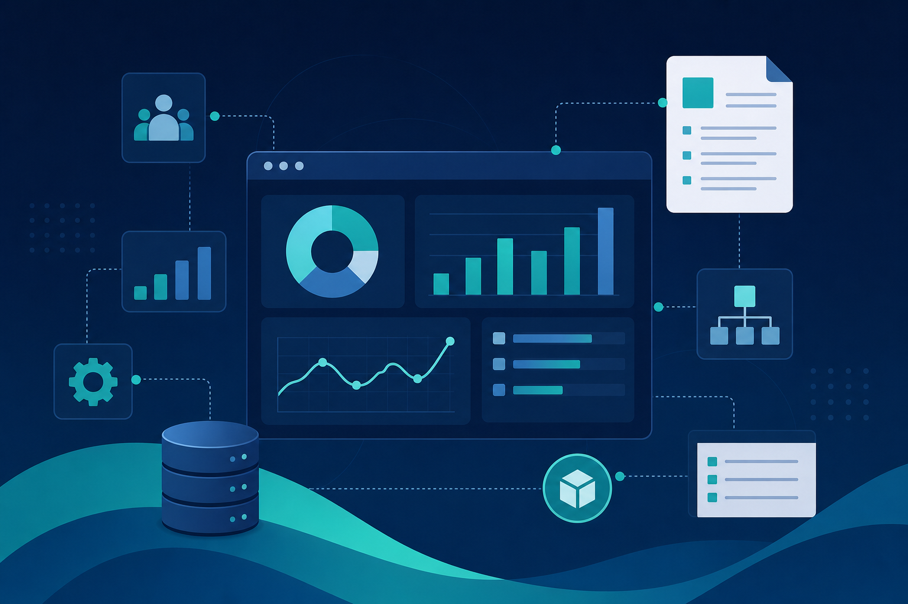
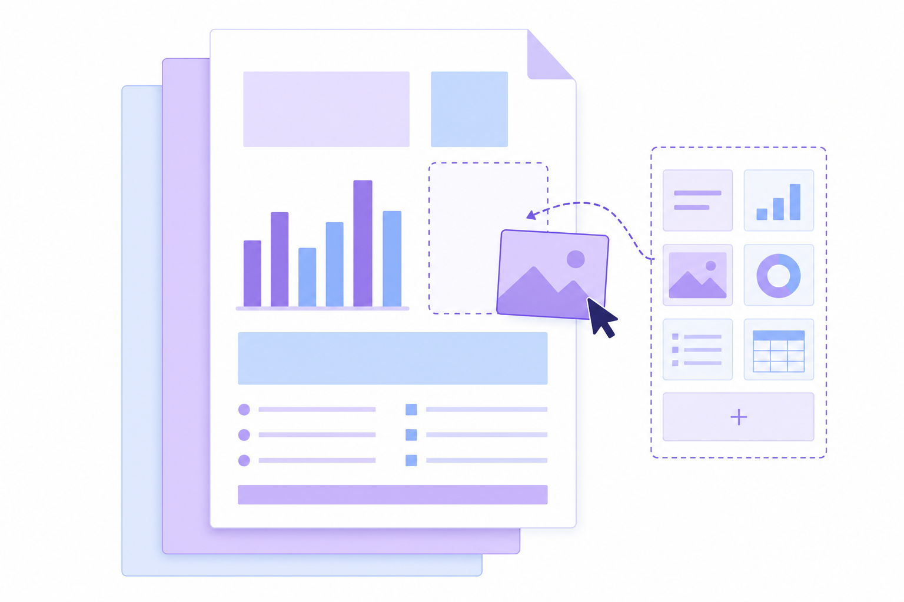
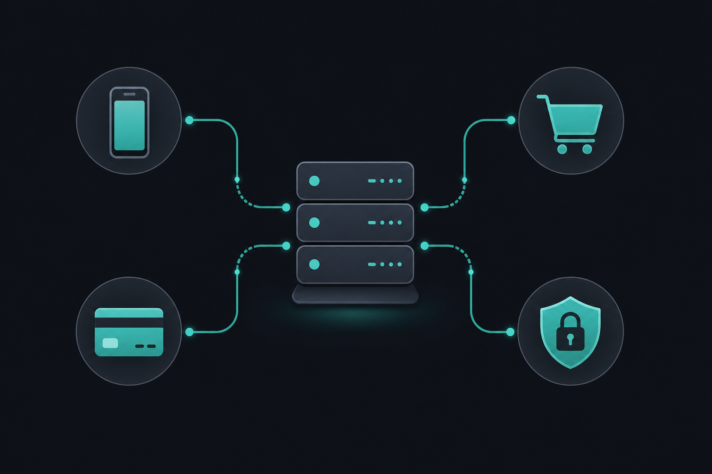

 

**9+ years on Odoo 9 → 19** · Python · PostgreSQL · JavaScript/OWL · REST APIs · Workflow automation

---

## 👋 About

Senior **Odoo Developer** and **Technical Team Leader** at **CTIT Software** (Jeddah). I deliver full-cycle ERP: analysis, architecture, custom development, integrations, deployment, and production support across **Egypt, Saudi Arabia, and Iraq**.

**Focus areas:** Saudi compliance (ZATCA, GOSI), eCommerce (Salla, Zid), payment gateways (Geidea), reusable product frameworks, and team leadership for **70+ live implementations**.

---

## 🏢 Enterprise Projects `15`

<table>
<thead>
<tr>
<th>#</th>
<th>Project</th>
<th>Industry</th>
<th>Odoo</th>
<th>Role</th>
<th>What I delivered</th>
</tr>
</thead>
<tbody>
<tr><td>01</td><td><b>CTIT Official Platform</b></td><td>ERP / SaaS</td><td>9–19</td><td>Team Leader</td><td>Company core product, Saudi EDI, subscriptions, shared frameworks, 70+ clients</td></tr>
<tr><td>02</td><td><b>CTIT SaaS Hosting</b></td><td>Cloud ERP</td><td>17</td><td>Lead</td><td>Automated hosting, backups, customer onboarding, subscription billing</td></tr>
<tr><td>03</td><td><b>Al Shatry</b></td><td>Trading / Wholesale</td><td>13 / 17</td><td>Senior</td><td>Full ERP, branches, landed costs, ZATCA e-invoicing</td></tr>
<tr><td>04</td><td><b>Al Bilady</b></td><td>Retail / Distribution</td><td>16 / 17</td><td>Lead</td><td>Multi-branch sales, inventory, accounting automation, management reports</td></tr>
<tr><td>05</td><td><b>Mega Trust</b></td><td>Distribution</td><td>17 / 18</td><td>Senior</td><td>Purchase approvals, warehouse visibility, cheques, Salla eCommerce sync</td></tr>
<tr><td>06</td><td><b>Roya</b></td><td>Multi-branch ERP</td><td>15</td><td>Senior</td><td>Per-branch numbering, tax reporting, custom invoices, HR insurance</td></tr>
<tr><td>07</td><td><b>Al Suwailim (Vegetables)</b></td><td>Fresh produce</td><td>17</td><td>Senior</td><td>Sales automation, ZATCA, partner connectivity, portal, stock-to-cash cycle</td></tr>
<tr><td>08</td><td><b>GOSI Compliance</b></td><td>HR / Insurance</td><td>17</td><td>Architect</td><td>Contribution rules, wage engine, audit trail, government API readiness</td></tr>
<tr><td>09</td><td><b>Bonya Real Estate</b></td><td>Property</td><td>17</td><td>Lead</td><td>Rental contracts, property accounting, Hijri dates, WhatsApp, letters of credit</td></tr>
<tr><td>10</td><td><b>IQAA Steel Factory</b></td><td>Manufacturing / POS</td><td>17</td><td>Lead</td><td>Arabic POS delivery flow, custom screens, order status tracking</td></tr>
<tr><td>11</td><td><b>Dabbos</b></td><td>Trading</td><td>17 / 18</td><td>Lead</td><td>Custom sales, purchase, stock reports and salesperson analytics</td></tr>
<tr><td>12</td><td><b>Aloofy</b></td><td>Retail / F&B</td><td>16</td><td>Senior</td><td>Large retail stack: POS, WhatsApp sales, partners, operational automation</td></tr>
<tr><td>13</td><td><b>AlMoasher Business</b></td><td>Enterprise</td><td>12–17</td><td>Senior</td><td>Sales, purchase, inventory, accounting, HR customization and security</td></tr>
<tr><td>14</td><td><b>Capital ERP</b></td><td>ERP (Iraq)</td><td>17</td><td>Senior</td><td>Finance and operations modules, external APIs, go-live support</td></tr>
<tr><td>15</td><td><b>Healthy (UAE / EG / KSA)</b></td><td>Healthcare</td><td>15</td><td>Developer</td><td>Multi-country rollout and regional business rules</td></tr>
</tbody>
</table>

---

## 🧩 Solutions & Integrations `20`

> Built with **Python**, **PostgreSQL**, **XML/QWeb**, **OWL/JavaScript**, plus **automation** and **scheduled jobs**

<table>
<thead>
<tr>
<th>Solution</th>
<th>Category</th>
<th>Capabilities</th>
</tr>
</thead>
<tbody>
<tr><td><b>Dynamic Report Designer</b></td><td>Reporting</td><td>No-code QWeb/DOCX reports, multiple corporate layouts, dot-matrix & summaries</td></tr>
<tr><td><b>Access & Permissions Studio</b></td><td>Security</td><td>Hide menus/fields/buttons/views; live Rules Mode on forms (JavaScript)</td></tr>
<tr><td><b>REST Application Gateway</b></td><td>Integration</td><td>JWT APIs, scopes, rate limits, webhooks, audit trail for mobile & 3rd parties</td></tr>
<tr><td><b>Webhook Orchestration</b></td><td>Integration</td><td>Event-driven callbacks tied to sales and messaging flows</td></tr>
<tr><td><b>ZATCA E-Invoicing</b></td><td>Compliance</td><td>Submit invoices, QR codes, retries, status sync with tax platform</td></tr>
<tr><td><b>Salla Marketplace Connector</b></td><td>eCommerce</td><td>Products, orders, stock, payments — real-time webhooks</td></tr>
<tr><td><b>Salla Enterprise Connector</b></td><td>eCommerce</td><td>High-volume sync for distribution clients</td></tr>
<tr><td><b>Zid Marketplace Connector</b></td><td>eCommerce</td><td>Catalog, orders, shipping & payment method mapping</td></tr>
<tr><td><b>Sales Order Workflow Automation</b></td><td>Automation</td><td>Confirm order → invoice → validate → deliver (configurable steps)</td></tr>
<tr><td><b>Geidea Payment Gateway</b></td><td>Payments</td><td>Payment links on quotations/invoices; callback status handling</td></tr>
<tr><td><b>GOSI Compliance Core</b></td><td>HR / KSA</td><td>Eligibility, rates, wages, contribution preparation & logs</td></tr>
<tr><td><b>GOSI Government API Layer</b></td><td>HR / API</td><td>Secure multi-connection profiles for future GOSI APIs</td></tr>
<tr><td><b>CTIT Core Business Pack</b></td><td>Platform</td><td>Saudi EDI, subscriptions, branch sales, portal & pro-forma flows</td></tr>
<tr><td><b>Dynamic List Column Manager</b></td><td>UI Tools</td><td>Show, hide, reorder and rename list columns without code</td></tr>
<tr><td><b>Developer Operations Dashboard</b></td><td>Management</td><td>Team KPIs, smart assignment, project health boards</td></tr>
<tr><td><b>Real Estate Management Suite</b></td><td>Property</td><td>Units, contracts, balances, client statements, Hijri reporting</td></tr>
<tr><td><b>Rental Contract Lifecycle</b></td><td>Property</td><td>Lease terms, milestones, expenses, partner ledger reports</td></tr>
<tr><td><b>Hijri Calendar for Odoo UI</b></td><td>Localization</td><td>Hijri picker on forms and lists (JavaScript calendars)</td></tr>
<tr><td><b>Multi-Branch Document Numbering</b></td><td>Accounting</td><td>Separate sequences per branch for sales, purchase & journals</td></tr>
<tr><td><b>SaaS Instance Provisioning</b></td><td>DevOps</td><td>Docker-based Odoo stacks, routing, backups, subscription packages</td></tr>
</tbody>
</table>

---

## 🎬 Highlights

### Access & Permissions Studio

<table>
<tr>
<td width="50%">

- Control what each user sees: menus, fields, buttons, reports
- **Rules Mode** — configure access directly on the live form
- Read-only mode, export restrictions, multi-company rules
- Rich **JavaScript / OWL** front-end behavior

</td>
<td width="50%" align="center">

<video controls width="100%" src="https://github.com/odoo00/odoo00/raw/main/assets/rules-studio-demo.mp4"></video>

<a href="https://github.com/odoo00/odoo00/raw/main/assets/rules-studio-demo.mp4">▶ Watch demo</a>

</td>
</tr>
</table>

---

### Dynamic Report Designer

<table>
<tr>
<td width="50%">

- Build invoices, contracts, and operational reports without Python
- Multiple ready-made visual themes
- DOCX merge and specialized print layouts
- Company-specific headers, footers, and branding

</td>
<td width="50%" align="center">

</td>
</tr>
</table>

---

### Integrations & Automation Hub

<table>
<tr>
<td width="50%">

- **ZATCA** · **Salla** · **Zid** · **Geidea** · mobile/logistics apps
- Automated sales, stock, and billing pipelines
- REST security: tokens, scopes, logging
- Production monitoring and error recovery

</td>
<td width="50%" align="center">

</td>
</tr>
</table>

---

## 🛠 Tech Stack

**Odoo 9 → 19** · OWL · QWeb · REST · Docker · Linux · Agile leadership

---

## 📊 GitHub Stats

---

## 📫 Contact

| | |
|---|---|
| 💼 **LinkedIn** | [linkedin.com/in/mohsen-sayed-hassan-12856a2a7](https://www.linkedin.com/in/mohsen-sayed-hassan-12856a2a7/) |
| 📧 **Email** | [dev.odooerp@gmail.com](mailto:dev.odooerp@gmail.com) |
| 📱 **Phone** | +20 127 752 3059 |

---

*Production client work lives in private repositories · This profile is a recruiter-friendly overview.*

⭐ Stars are appreciated.

